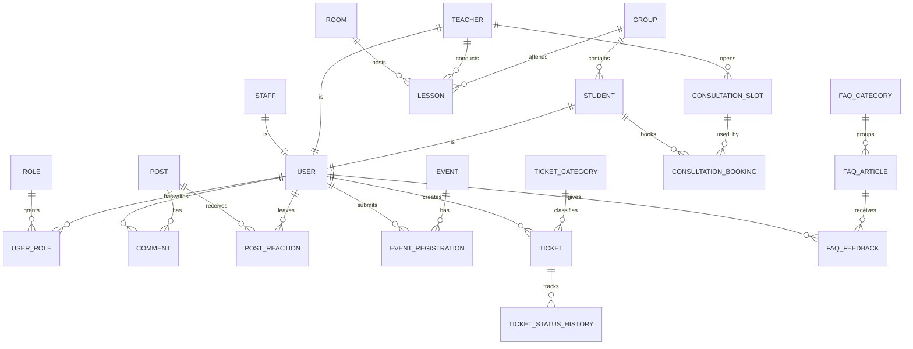

# 3.0. ER-модель предметной области

## 1. ER-диаграмма (Mermaid)

## 2. Таблица сущностей и атрибутов

| Сущность | Ключевые атрибуты | Назначение |
|---|---|---|
| `User` | `id`, `email`, `full_name`, `status`, `created_at` | Базовый аккаунт пользователя |
| `Role` | `id`, `code`, `name` | Ролевая модель (`student`, `teacher`, `staff`, `admin`) |
| `UserRole` | `user_id`, `role_id` | Связь many-to-many пользователь ↔ роль |
| `Student` | `user_id`, `group_id`, `enrollment_year` | Профиль студента |
| `Teacher` | `user_id`, `department_id`, `position` | Профиль преподавателя |
| `Staff` | `user_id`, `department_id` | Профиль сотрудника администрации |
| `Group` | `id`, `name`, `faculty_id`, `course` | Учебная группа |
| `Lesson` | `id`, `group_id`, `teacher_id`, `room_id`, `start_at`, `end_at`, `type` | Элемент расписания |
| `Room` | `id`, `building`, `floor`, `number` | Аудитория/локация занятия |
| `Post` | `id`, `author_id`, `type`, `title`, `body`, `status`, `published_at` | Новость или пост о событии |
| `Comment` | `id`, `post_id`, `author_id`, `body`, `created_at` | Комментарий к посту |
| `PostReaction` | `id`, `post_id`, `user_id`, `reaction_type` | Реакция (лайк и т.д.) |
| `Event` | `id`, `post_id`, `capacity`, `start_at`, `location`, `status` | Событие/мероприятие на базе поста |
| `EventRegistration` | `id`, `event_id`, `user_id`, `status`, `created_at` | Заявка на участие в мероприятии |
| `TicketCategory` | `id`, `name`, `sla_hours` | Категория обращения |
| `Ticket` | `id`, `creator_id`, `category_id`, `title`, `description`, `status`, `priority` | Заявка в help-desk |
| `TicketStatusHistory` | `id`, `ticket_id`, `old_status`, `new_status`, `changed_by`, `changed_at` | Аудит переходов статусов |
| `ConsultationSlot` | `id`, `teacher_id`, `start_at`, `end_at`, `status` | Доступный слот консультации |
| `ConsultationBooking` | `id`, `slot_id`, `student_id`, `topic`, `status` | Запись студента на слот |
| `FaqCategory` | `id`, `name` | Категория статей FAQ |
| `FaqArticle` | `id`, `category_id`, `title`, `body`, `status`, `updated_at` | Статья базы знаний |
| `FaqFeedback` | `id`, `article_id`, `user_id`, `is_helpful`, `created_at` | Оценка полезности FAQ |

## 3. Связь сущностей с бизнес-функциями (CRUD + роли)

| Сущность | Кто создаёт | Кто читает | Кто изменяет |
|---|---|---|---|
| `Lesson` | Админ ИС / учебная часть | Студент, Преподаватель | Админ ИС / учебная часть |
| `Post` | Преподаватель, Администрация, Модератор | Все авторизованные | Автор, Модератор |
| `EventRegistration` | Студент | Студент, организатор | Студент (до дедлайна), организатор |
| `Ticket` | Студент | Студент, администрация | Администрация, студент (ограниченно) |
| `TicketStatusHistory` | Система (авто) | Студент, администрация | Не изменяется (append-only) |
| `ConsultationSlot` | Преподаватель | Студент, преподаватель | Преподаватель |
| `ConsultationBooking` | Студент | Студент, преподаватель | Студент/преподаватель по правилам |
| `FaqArticle` | Администрация/редактор | Все авторизованные | Администрация/редактор |
| `FaqFeedback` | Студент/любой пользователь | Администрация/редактор | Не изменяется (или soft-update) |
